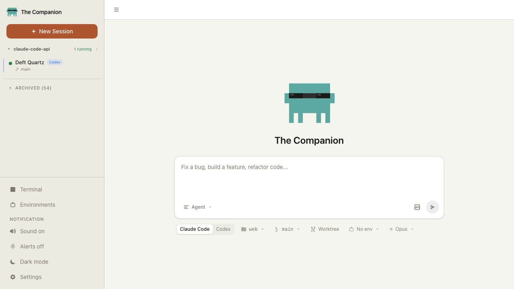

<p align="center">
  
</p>

<h1 align="center">Campfire</h1>
<p align="center"><strong>The collaborative web platform for AI coding agents.</strong></p>
<p align="center">Run Claude Code, Codex, Goose, Aider, OpenHands, OpenClaw, and OpenCode sessions side by side — with real-time collaboration, permission voting, session replay, webhooks, a public gallery, a prompt library, Linear integration, and collective intelligence across agents.</p>

<p align="center">
  <a href="https://www.npmjs.com/package/the-companion"></a>
  <a href="https://www.npmjs.com/package/the-companion"></a>
  <a href="LICENSE"></a>
</p>

---

## Table of Contents

- [Quick Start](#quick-start)
- [Features](#features)
  - [Multi-Agent Sessions](#multi-agent-sessions)
  - [Real-Time Collaboration](#real-time-collaboration)
  - [Permission Control & Voting](#permission-control--voting)
  - [Session Replay](#session-replay)
  - [Fork & Branch](#fork--branch)
  - [Session Gallery](#session-gallery)
  - [Prompt Library](#prompt-library)
  - [Linear Integration](#linear-integration)
  - [Webhooks](#webhooks)
  - [Scheduled Tasks (Cron)](#scheduled-tasks-cron)
  - [Adapter Registry](#adapter-registry)
  - [Cost Dashboard](#cost-dashboard)
  - [Environment Profiles](#environment-profiles)
  - [Git Integration](#git-integration)
  - [Embedded Terminal](#embedded-terminal)
  - [Protocol Recording](#protocol-recording)
  - [Docker Containers](#docker-containers)
  - [PWA & Mobile](#pwa--mobile)
  - [Auto-Naming](#auto-naming)
  - [Collective Intelligence](#collective-intelligence)
  - [TUI Client](#tui-client)
- [Architecture](#architecture)
- [Docker Deployment](#docker-deployment)
- [CLI Reference](#cli-reference)
- [REST API Reference](#rest-api-reference)
- [WebSocket Protocol](#websocket-protocol)
- [Development](#development)
- [Docs](#docs)
- [License](#license)

---

## Quick Start

There are three ways to run Campfire: from npm, from source, or with Docker.

### Option 1: npm (fastest)

If you just want to run Campfire without cloning the repo:

```bash
# Install Bun if you don't have it
curl -fsSL https://bun.sh/install | bash

# Run Campfire (downloads and starts automatically)
bunx the-companion
```

Open [http://localhost:3456](http://localhost:3456). That's it.

To run on a different port:

```bash
bunx the-companion --port 8080
```

### Option 2: Run from source (native)

Clone the repository and run directly with Bun:

```bash
# 1. Clone the repo
git clone https://github.com/your-org/campfire.git
cd campfire

# 2. Install dependencies
cd web
bun install

# 3a. Development mode (hot reload, frontend on :5174, backend on :3457)
bun run dev

# 3b. OR production mode (single server on :3456)
bun run build
bun run start
```

**Development mode** starts two processes:
- Backend on `http://localhost:3457` (auto-restarts on file changes)
- Frontend on `http://localhost:5174` (Vite HMR, proxies API/WS to backend)

Open [http://localhost:5174](http://localhost:5174) in development mode.

**Production mode** builds the frontend into static files and serves everything from a single server:

Open [http://localhost:3456](http://localhost:3456) in production mode.

### Option 3: Docker

Build and run with Docker Compose (no Bun installation needed):

```bash
# 1. Clone the repo
git clone https://github.com/your-org/campfire.git
cd campfire

# 2. Build and start the container
docker compose up

# Or build and run in the background
docker compose up -d
```

Open [http://localhost:3456](http://localhost:3456).

To build the Docker image manually without Compose:

```bash
# Build the image
docker build -t campfire:latest .

# Run the container
docker run -d \
  --name campfire \
  -p 3456:3456 \
  -v campfire-data:/home/campfire/.companion \
  -v campfire-sessions:/tmp/vibe-sessions \
  campfire:latest
```

To stop and remove:

```bash
# Docker Compose
docker compose down

# Or manual
docker stop campfire && docker rm campfire
```

See [Docker Deployment](#docker-deployment) for advanced configuration (mounting agent CLIs, reverse proxy, environment variables).

### Requirements

**For native (npm or source):**
- [Bun](https://bun.sh) >= 1.0
- At least one agent CLI installed and on your `PATH`:
  - [Claude Code](https://docs.anthropic.com/en/docs/claude-code) — `npm install -g @anthropic-ai/claude-code`
  - [Codex](https://github.com/openai/codex) — `npm install -g @openai/codex`
  - [Goose](https://github.com/block/goose) — `brew install goose` or see [docs](https://github.com/block/goose)
  - [Aider](https://aider.chat) — `pip install aider-chat`
  - [OpenHands](https://github.com/All-Hands-AI/OpenHands) — see [docs](https://github.com/All-Hands-AI/OpenHands)
  - [OpenClaw](https://github.com/anomalyco/openclaw) — `openclaw` binary on `PATH`, set `OPENCLAW_GATEWAY_TOKEN` and `OPENCLAW_GATEWAY_URL`
  - [OpenCode](https://github.com/anomalyco/opencode) — `opencode` binary on `PATH`

**For Docker:**
- [Docker](https://docs.docker.com/get-docker/) >= 20.0
- Agent CLIs are **not** included in the Docker image — see [Running with Agent CLIs](#running-with-agent-CLIs) for how to mount or install them

---

## Features

### Multi-Agent Sessions

Run parallel sessions across seven agent backends from a single browser tab. Each session streams output, tool calls, and results in a unified timeline. The frontend is completely backend-agnostic — it renders the same UI regardless of which agent is running.

**Supported backends:**

| Backend | Protocol | How it connects |
|---------|----------|-----------------|
| Claude Code | NDJSON over WebSocket | Spawned with `--sdk-url` flag |
| Codex | JSON-RPC over stdio | Spawned as `codex app-server` |
| Goose | JSON-RPC 2.0 (ACP) over stdio | Spawned as `goose acp` |
| Aider | stdout parsing over stdio | Spawned as `aider --no-pretty --yes` |
| OpenHands | JSON-RPC 2.0 (ACP) over stdio | Spawned as `openhands acp` |
| OpenClaw | JSON-RPC 2.0 (ACP) over stdio | Spawned as `openclaw acp`; requires `OPENCLAW_GATEWAY_TOKEN` + `OPENCLAW_GATEWAY_URL` |
| OpenCode | JSON-RPC 2.0 (ACP) over stdio | Spawned as `opencode acp`; model set via `OPENCODE_MODEL` |

**Creating a session:**

1. Click **New Session** in the sidebar
2. Choose a backend (Claude Code, Codex, Goose, Aider, OpenHands, OpenClaw, or OpenCode)
3. Select a model (backend-specific model lists)
4. Set the working directory for the session
5. Optionally choose a permission mode, environment profile, or git branch
6. Click **Create**

**Session options:**

| Option | Description |
|--------|-------------|
| Backend | Which agent CLI to use |
| Model | AI model to run (e.g. `claude-sonnet-4-5-20250929`, `o3`, `gpt-4.1`) |
| Permission mode | `default`, `bypassPermissions`, `oneTouchApprovals`, `manualApprovals` |
| Working directory | Folder the agent operates in |
| Environment profile | Pre-saved set of environment variables to inject |
| Git branch | Check out a specific branch before starting |
| Use worktree | Create an isolated git worktree (keeps branches separate) |
| Create branch | Create the branch if it doesn't exist |
| Docker container | Run the session inside a Docker container (Claude only) |
| Internet access | Enable web search for Codex |
| Allowed tools | Restrict which tools the agent can use |

**Session lifecycle:**

- **Running** — agent is processing, streaming output
- **Idle** — agent is waiting for input
- **Compacting** — agent is compacting context (Claude Code)
- **Exited** — agent process has stopped

Sessions persist to disk and survive server restarts. When the server restarts, running CLI processes are detected by PID and given a grace period to reconnect. If they don't, they're killed and relaunched with `--resume`.

**Managing sessions:**

- **Rename** — click the session name in the sidebar to edit inline
- **Kill** — stop the running agent process
- **Relaunch** — restart a stopped session (uses `--resume` for Claude Code)
- **Archive** — hide the session from the active list while preserving history
- **Delete** — permanently remove the session (also cleans up worktrees and containers)

---

### Real-Time Collaboration

Share any session with teammates using invite links. Multiple people can watch and interact with the same session simultaneously.

**How to share a session:**

1. Open a running session
2. Click the **Share** button in the top bar
3. Choose a role for the invited user:
   - **Collaborator** — can send messages and vote on permissions
   - **Spectator** — watch-only (cannot send messages or vote)
4. Copy the generated link and share it

The invite link looks like `http://localhost:3456/#/join/<token>`. When someone opens it, they join the session with the assigned role.

**Presence indicators:**

Connected users appear as colored avatars in the top bar:
- **Blue** — Owner (the person who created the session)
- **Green** — Collaborator (can interact)
- **Gray** — Spectator (watch-only)

Presence updates are broadcast in real time — you see when someone joins or leaves.

**Roles and permissions:**

| Capability | Owner | Collaborator | Spectator |
|-----------|-------|--------------|-----------|
| View session output | Yes | Yes | Yes |
| Send messages | Yes | Yes | No |
| Approve/deny permissions | Yes | Yes | No |
| Vote on tool calls | Yes | Yes | No |
| Interrupt the agent | Yes | Yes | No |
| Change model or mode | Yes | Yes | No |
| Configure MCP servers | Yes | Yes | No |

The first browser to connect to a session becomes the **Owner**. Subsequent connections default to **Collaborator** unless they join via a spectator invite link.

---

### Permission Control & Voting

Every risky tool call (file writes, bash commands, etc.) surfaces a permission banner at the top of the chat. The banner shows what the agent wants to do and lets you approve, deny, or apply a permission rule.

**Permission banner displays:**

| Tool | What you see |
|------|-------------|
| Bash | The exact command with `$` prefix |
| Edit | Side-by-side diff showing old vs new content |
| Write | The full file content being written |
| Read | The file path being read |
| Glob / Grep | The search pattern and path |
| AskUserQuestion | Multiple-choice options with a custom text input |

**Actions available:**

- **Allow** — approve this specific tool call
- **Deny** — reject this tool call
- **Permission suggestions** — apply a broader rule (e.g. "Allow for session", "Allow always", "Trust directory")

**Voting (collaborative sessions):**

When multiple viewers are connected, permission requests become votes. The voting behavior is configurable:

| Policy | How it works |
|--------|-------------|
| `majority-rules` | Action is allowed if more than half vote "allow" (default) |
| `any-deny-blocks` | A single "deny" vote blocks the action |
| `owner-decides` | Only the owner's vote counts |

Configure the voting policy via the UI or API:

```bash
# Get current policy
curl http://localhost:3456/api/voting-policy

# Change policy
curl -X PUT http://localhost:3456/api/voting-policy \
  -H "Content-Type: application/json" \
  -d '{"policy": "any-deny-blocks"}'
```

Votes have a **30-second deadline**. If the deadline passes, the vote resolves based on collected votes. The UI shows a countdown timer, current vote tally, and voter avatars.

---

### Session Replay

Scrub through completed sessions at 1x / 2x / 4x / 8x speed. Every tool call, permission decision, and streaming token is preserved in protocol recordings.

**How to use replay:**

1. Open a completed session from the sidebar
2. Click the **Recordings** section to see available recording files
3. Click a recording to open the replay player
4. Use the playback controls to play, pause, and change speed

**Replay controls:**
- Play / Pause toggle
- Speed selector: 1x, 2x, 4x, 8x
- Progress scrubber for seeking

**Recording format:**

Recordings are stored as JSONL (newline-delimited JSON) files in `~/.companion/recordings/`. Each line captures the exact raw message as it was sent or received:

```json
{"ts": 1771153996875, "dir": "in", "raw": "{\"type\":\"system\",...}", "ch": "cli"}
```

- `ts` — Unix timestamp in milliseconds
- `dir` — `"in"` (received by server) or `"out"` (sent by server)
- `ch` — `"cli"` (agent process) or `"browser"` (frontend)
- `raw` — exact original message string, never re-serialized

**Recording management:**

```bash
# List all recordings
curl http://localhost:3456/api/recordings

# Check if a session is being recorded
curl http://localhost:3456/api/sessions/:id/recording/status

# Start/stop recording for a specific session
curl -X POST http://localhost:3456/api/sessions/:id/recording/start
curl -X POST http://localhost:3456/api/sessions/:id/recording/stop
```

Recording is enabled by default. Disable globally with `COMPANION_RECORD=0`. Files auto-rotate when total lines exceed 100,000 (configurable with `COMPANION_RECORDINGS_MAX_LINES`).

---

### Fork & Branch

Fork any session at any point in its conversation to explore a different path. Forks create a new session with the message history up to the fork point, optionally on a new git worktree.

**How to fork:**

1. **From the top bar** — click the **Fork** button to fork at the current point
2. **From any message** — hover over a message and click the fork icon to fork from that specific point

**What happens when you fork:**

1. The message history is copied up to the selected point
2. If the session is in a git repository, a new worktree is created for isolation
3. A new session is launched with the copied history
4. The forked session shows a "forked from" indicator linking back to the original

**Fork options:**

```bash
curl -X POST http://localhost:3456/api/sessions/:id/fork \
  -H "Content-Type: application/json" \
  -d '{
    "messageIndex": 5,
    "model": "claude-sonnet-4-5-20250929",
    "permissionMode": "bypassPermissions",
    "branch": "experiment/new-approach"
  }'
```

| Field | Description |
|-------|-------------|
| `messageIndex` | Fork after this message (0-indexed). Omit to fork at the end. |
| `model` | Override the model for the forked session |
| `permissionMode` | Override permission mode |
| `branch` | Git branch name for the worktree |

---

### Session Gallery

Publish your best sessions to a gallery that anyone on your Campfire instance can browse. Gallery entries include session metadata, cost, duration, and a direct link to replay.

**How to publish:**

1. Navigate to the **Gallery** page from the sidebar
2. Click **Add to Gallery**
3. Select a completed session
4. Add a name, description, and tags
5. Click **Publish**

**Browsing the gallery:**

The gallery supports filtering and sorting:

| Filter | Example |
|--------|---------|
| Backend | Show only Claude Code sessions |
| Cost range | Sessions between $0.01 and $1.00 |
| Tags | Filter by `migration`, `refactor`, `bugfix`, etc. |
| Featured only | Show only featured entries |

| Sort by | Description |
|---------|-------------|
| Votes | Most upvoted first |
| Recent | Newest first |
| Cost | Cheapest or most expensive first |
| Duration | Shortest or longest first |

**Voting and featuring:**

- Click the up/down arrows on any gallery card to vote (anonymous, IP-deduplicated)
- Admins can toggle the **Featured** star to highlight exceptional sessions

**Gallery entry metadata:**

Each entry captures a snapshot of the session at publish time: backend type, model, total cost, duration, lines added/removed, and number of turns. Click **View Replay** on any card to watch the session.

```bash
# List gallery entries with filters
curl "http://localhost:3456/api/gallery?backend=claude&sortBy=votes&featured=true"

# Publish a session
curl -X POST http://localhost:3456/api/gallery \
  -H "Content-Type: application/json" \
  -d '{
    "sessionId": "abc-123",
    "name": "Migrated auth to OAuth2",
    "description": "Full migration from session-based auth to OAuth2 with PKCE",
    "tags": ["migration", "auth", "oauth"]
  }'

# Vote on an entry
curl -X POST http://localhost:3456/api/gallery/:id/vote \
  -H "Content-Type: application/json" \
  -d '{"direction": 1}'

# Toggle featured status
curl -X POST http://localhost:3456/api/gallery/:id/feature
```

---

### Prompt Library

Save reusable prompt snippets and insert them into any message with `@` in the composer. Prompts can be scoped globally or to a specific project directory.

**How to create a prompt:**

1. Navigate to the **Prompts** page from the sidebar
2. Click **+ New Prompt**
3. Enter a name and the prompt text
4. Choose scope: **Global** (available everywhere) or **Project** (scoped to a path prefix)
5. Click **Save**

**Inserting prompts in the composer:**

Type `@` in the message box to open the prompt picker. Start typing to filter by name or content. Use Arrow keys to navigate, Tab or Enter to insert.

The full content of the selected prompt replaces the `@query` in your message, so you can mix prompt snippets with your own text.

**REST API:**

```bash
# List prompts (optionally filtered by cwd)
curl "http://localhost:3456/api/prompts?cwd=/home/user/my-project"

# Create a prompt
curl -X POST http://localhost:3456/api/prompts \
  -H "Content-Type: application/json" \
  -d '{
    "name": "Code review checklist",
    "content": "Please review for: 1) correctness, 2) edge cases, 3) performance, 4) test coverage",
    "scope": "global"
  }'

# Update a prompt
curl -X PUT http://localhost:3456/api/prompts/:id \
  -H "Content-Type: application/json" \
  -d '{"name": "Updated name", "content": "Updated content"}'

# Delete a prompt
curl -X DELETE http://localhost:3456/api/prompts/:id
```

Prompts are stored at `~/.companion/prompts.json`.

---

### Linear Integration

Connect your Linear workspace to browse issues, inject issue context into sessions, and auto-generate branch names from issue titles.

**Setup:**

1. Navigate to **Integrations** → **Linear** from the sidebar
2. Create a personal API key at `linear.app/settings/api`
3. Paste your key and click **Connect**

**What it enables:**

- Browse and search Linear issues when creating a new session
- Inject the issue title and description as startup context for the agent
- Auto-generate a recommended git branch name from the issue (e.g. `feat/eng-123-add-auth`)

**REST API:**

```bash
# Check connection status
curl http://localhost:3456/api/linear/connection
# → {"connected": true, "viewer": {"name": "...", "email": "..."}, "teams": [...]}

# Search issues
curl "http://localhost:3456/api/linear/issues?query=auth&limit=10"
# → {"issues": [{"id": "...", "identifier": "ENG-123", "title": "Add OAuth", ...}]}
```

The API key is stored in `~/.companion/settings.json` and never exposed via the settings GET endpoint (only `linearApiKeyConfigured: true/false` is returned).

---

### Webhooks

Receive HTTP POST notifications when events happen in your sessions. Configure webhooks with event filters, HMAC-SHA256 signing, and automatic retries.

**How to set up a webhook:**

1. Navigate to the **Webhooks** page from the sidebar
2. Click **Create Webhook**
3. Enter the destination URL
4. Select which events to subscribe to
5. Optionally add a signing secret and session filters
6. Click **Create**

**Available events:**

| Event | When it fires |
|-------|---------------|
| `session.created` | A new session starts |
| `session.completed` | A session finishes successfully |
| `session.failed` | A session exits with an error |
| `permission.requested` | An agent requests permission for a tool call |
| `permission.resolved` | A permission request is approved or denied |
| `turn.completed` | An agent completes a turn (each back-and-forth) |
| `cost.threshold` | Session cost crosses a threshold |

**Payload format:**

```json
{
  "event": "session.completed",
  "timestamp": 1771153996875,
  "sessionId": "abc-123",
  "data": {
    "backendType": "claude",
    "model": "claude-sonnet-4-5-20250929",
    "totalCostUsd": 0.42,
    "numTurns": 12,
    "durationMs": 180000
  }
}
```

**HMAC-SHA256 signing:**

If you provide a `secret`, every delivery includes an `X-Campfire-Signature` header:

```
X-Campfire-Signature: sha256=<hex-encoded-hmac>
```

Verify the signature on your server by computing `HMAC-SHA256(secret, request_body)` and comparing.

**Retry behavior:**

Failed deliveries are retried 3 times with exponential backoff: 1s, 5s, 15s. Delivery stats (total, failed, last delivery time) are tracked per webhook.

**Session filters:**

Narrow a webhook to specific sessions by backend type or working directory:

```json
{
  "sessionFilter": {
    "backendType": "claude",
    "cwd": "/home/user/my-project"
  }
}
```

**Slack integration:**

Webhook payloads include Slack-compatible formatting. Point a webhook at a Slack incoming webhook URL and events will render as formatted messages.

**Testing:**

Click the **Test** button on any webhook to send a test payload and verify your endpoint is receiving events correctly.

```bash
# Create a webhook
curl -X POST http://localhost:3456/api/webhooks \
  -H "Content-Type: application/json" \
  -d '{
    "name": "Slack Alerts",
    "url": "https://hooks.slack.com/services/...",
    "events": ["session.completed", "session.failed", "cost.threshold"],
    "secret": "my-signing-secret",
    "enabled": true
  }'

# Test delivery
curl -X POST http://localhost:3456/api/webhooks/:id/test

# Toggle enable/disable
curl -X POST http://localhost:3456/api/webhooks/:id/toggle
```

---

### Scheduled Tasks (Cron)

Run autonomous agent sessions on a schedule — daily test suites, nightly code reviews, weekly dependency updates, or one-shot migration scripts.

**How to create a scheduled task:**

1. Navigate to the **Scheduled** page from the sidebar
2. Click **Create Job**
3. Fill in the form:
   - **Name** — human-readable label (e.g. "Nightly Test Suite")
   - **Prompt** — the instruction to send to the agent
   - **Schedule** — cron expression (`0 2 * * *`) or ISO datetime for one-shot
   - **Backend** — which agent to use
   - **Model** — which model to run
   - **Working directory** — where to run
   - **Permission mode** — typically `bypassPermissions` for autonomous execution
   - **Environment profile** — optional API keys and variables
4. Click **Create**

**Cron expression examples:**

| Expression | Meaning |
|-----------|---------|
| `0 2 * * *` | Every day at 2:00 AM |
| `0 9 * * 1` | Every Monday at 9:00 AM |
| `*/30 * * * *` | Every 30 minutes |
| `0 0 1 * *` | First day of every month at midnight |

**One-shot tasks:**

Set `recurring: false` and provide an ISO datetime as the schedule (e.g. `2025-12-31T23:59:00Z`). The job runs once at that time and auto-disables.

**Execution tracking:**

Each execution creates a session and tracks:
- Start time and completion time
- Success or failure status
- Cost incurred
- Link to the session for full replay

Jobs auto-disable after repeated consecutive failures to prevent runaway costs.

**Managing jobs:**

```bash
# List all jobs
curl http://localhost:3456/api/cron/jobs

# Create a recurring job
curl -X POST http://localhost:3456/api/cron/jobs \
  -H "Content-Type: application/json" \
  -d '{
    "name": "Nightly Tests",
    "prompt": "Run the full test suite and fix any failures",
    "schedule": "0 2 * * *",
    "recurring": true,
    "backendType": "claude",
    "model": "claude-sonnet-4-5-20250929",
    "cwd": "/home/user/my-project",
    "permissionMode": "bypassPermissions"
  }'

# Manually trigger a job
curl -X POST http://localhost:3456/api/cron/jobs/:id/run

# Enable/disable
curl -X POST http://localhost:3456/api/cron/jobs/:id/toggle

# View execution history
curl http://localhost:3456/api/cron/jobs/:id/executions
```

---

### Adapter Registry

Install community agent adapters from npm to add new backends to Campfire. Adapters are npm packages with a `campfireAdapter` field in their `package.json`.

**Installing an adapter:**

```bash
# Via CLI
the-companion install-adapter @campfire/example-adapter

# Via API
curl -X POST http://localhost:3456/api/adapters/install \
  -H "Content-Type: application/json" \
  -d '{"npmPackage": "@campfire/example-adapter"}'
```

Once installed, the adapter appears as a new backend option when creating sessions.

**Managing adapters in the UI:**

1. Navigate to the **Adapters** page from the sidebar
2. View installed adapters with their metadata (name, version, protocol, models)
3. Install new adapters by entering the npm package name
4. Uninstall adapters with the remove button

**Adapter metadata:**

Each adapter's `package.json` must include:

```json
{
  "campfireAdapter": {
    "name": "my-agent",
    "displayName": "My Agent",
    "binaryName": "my-agent-cli",
    "protocol": "stdio",
    "models": [
      { "value": "model-v1", "label": "Model V1" }
    ],
    "modes": [
      { "value": "default", "label": "Default" }
    ]
  }
}
```

**Writing your own adapter:**

See [`web/server/ADAPTERS.md`](web/server/ADAPTERS.md) for a step-by-step guide. Adapters implement the `AgentAdapter` interface with methods for sending/receiving messages, session metadata, and disconnection handling.

```bash
# List installed adapters
curl http://localhost:3456/api/adapters

# Uninstall
curl -X DELETE http://localhost:3456/api/adapters/my-agent
```

---

### Cost Dashboard

Every session tracks API costs in real time. The cost is displayed in the top bar during a session and in the session details panel.

**What's tracked:**

- Total cost in USD per session
- Number of turns (back-and-forth exchanges)
- Context usage percentage (how much of the context window is used)
- Lines added and removed
- Session duration

**Shareable cost cards:**

When a session completes, a cost card is generated as a downloadable PNG image containing the session name, cost, duration, turns, model, and backend type — with Campfire branding. Share these cards to show off your results.

**Cost information in the UI:**

- **Top bar** — live cost ticker during active sessions
- **Task panel** — detailed stats (cost, turns, context %, lines changed, duration)
- **Gallery cards** — cost displayed on each published session

---

### Environment Profiles

Save named sets of environment variables and inject them into agent sessions. This is useful for managing API keys, database URLs, and other secrets across different projects.

**How to use:**

1. Navigate to the **Environments** page from the sidebar
2. Click **Create Profile**
3. Enter a name (e.g. "Production", "Staging")
4. Add key-value pairs for your environment variables
5. Click **Save**

When creating a session, select an environment profile from the dropdown. All variables from that profile are injected into the agent's environment.

**Profile structure:**

```json
{
  "name": "Production",
  "slug": "production",
  "variables": {
    "ANTHROPIC_API_KEY": "sk-ant-...",
    "DATABASE_URL": "postgres://prod-host/db",
    "REDIS_URL": "redis://prod-redis:6379"
  }
}
```

Profiles are stored as individual JSON files in `~/.companion/envs/`.

```bash
# List profiles
curl http://localhost:3456/api/envs

# Create a profile
curl -X POST http://localhost:3456/api/envs \
  -H "Content-Type: application/json" \
  -d '{
    "name": "Staging",
    "variables": {
      "API_KEY": "sk-staging-...",
      "DEBUG": "true"
    }
  }'

# Update a profile
curl -X PUT http://localhost:3456/api/envs/staging \
  -H "Content-Type: application/json" \
  -d '{"variables": {"API_KEY": "sk-new-key", "DEBUG": "false"}}'

# Delete a profile
curl -X DELETE http://localhost:3456/api/envs/staging
```

---

### Git Integration

Campfire tracks git state for every session and provides tools for branch and worktree management.

**What's tracked per session:**

- Current branch name
- Ahead/behind counts relative to the remote
- Whether the session is in a worktree
- Total lines added and removed (from tool calls)
- Repository root path

This information is displayed in the sidebar next to each session and updated in real time.

**Worktrees:**

Worktrees let you run multiple sessions on different branches without switching branches in your main repo. Each worktree is a separate checkout of your repository.

When creating a session with "Use worktree" enabled:
1. A new worktree is created for the selected branch
2. The session runs in the worktree directory
3. A `CLAUDE.md` file is injected with guardrails (e.g. "Stay on this branch")
4. When the session is deleted, the worktree is cleaned up if there are no uncommitted changes

**GitHub PR status:**

If the `gh` CLI is installed and authenticated, Campfire polls for PR metadata on the session's branch:

- PR title, number, state (open/closed/merged)
- Draft status
- Review decision (approved/changes requested/pending)
- CI check status (passing/failing/pending)
- Review thread counts (resolved/unresolved)

PR status is displayed in the task panel and updates automatically.

```bash
# Get repository info
curl "http://localhost:3456/api/git/repo-info?path=/home/user/project"

# List branches
curl "http://localhost:3456/api/git/branches?repoRoot=/home/user/project"

# Create a worktree
curl -X POST http://localhost:3456/api/git/worktree \
  -H "Content-Type: application/json" \
  -d '{
    "repoRoot": "/home/user/project",
    "branch": "feature/new-feature",
    "createBranch": true
  }'

# Fetch and pull
curl -X POST http://localhost:3456/api/git/fetch \
  -H "Content-Type: application/json" \
  -d '{"repoRoot": "/home/user/project"}'
```

---

### Embedded Terminal

A full PTY terminal is available alongside your sessions. Use it for git operations, running tests, or any other command-line tasks without leaving Campfire.

**How to use:**

1. Click **Terminal** in the sidebar footer
2. A terminal spawns in the configured working directory
3. Type commands as you would in any terminal
4. The terminal supports full ANSI colors, cursor movement, and resize

The terminal connects via WebSocket (`/ws/terminal/:id`) and supports all standard terminal operations.

```bash
# Spawn a terminal
curl -X POST http://localhost:3456/api/terminal/spawn \
  -H "Content-Type: application/json" \
  -d '{"cwd": "/home/user/project", "cols": 120, "rows": 40}'

# Kill the terminal
curl -X POST http://localhost:3456/api/terminal/kill
```

---

### Protocol Recording

The server automatically records all raw protocol messages to JSONL files. This captures the exact bytes exchanged between the agent CLI and the server, and between the server and browser clients.

**Configuration:**

| Variable | Default | Description |
|----------|---------|-------------|
| `COMPANION_RECORD` | `1` | Set to `0` or `false` to disable |
| `COMPANION_RECORDINGS_DIR` | `~/.companion/recordings` | Output directory |
| `COMPANION_RECORDINGS_MAX_LINES` | `100000` | Auto-rotation threshold |

**File format:**

File naming: `{sessionId}_{backendType}_{ISO-timestamp}_{randomSuffix}.jsonl`

```jsonl
{"ts":1771153996875,"dir":"in","raw":"{\"type\":\"system\",\"subtype\":\"init\",...}","ch":"cli"}
{"ts":1771153996900,"dir":"out","raw":"{\"type\":\"session_init\",...}","ch":"browser"}
```

Recordings are useful for debugging protocol issues, building replay-based tests, and understanding how agents communicate.

---

### Docker Containers

Optionally sandbox sessions inside Docker containers for isolation. When enabled, the agent runs inside a container with the working directory mounted at `/workspace`.

**How it works:**

1. When creating a session, enable the **Docker container** option
2. Choose a Docker image (default: `companion-dev:latest`)
3. Optionally configure ports, volumes, and environment variables
4. The session runs inside the container with `~/.claude` mounted read-only for authentication

**Requirements:**

- Docker must be installed and running on the host
- The Docker socket must be accessible to the Campfire process

```bash
# Check Docker availability
curl http://localhost:3456/api/containers/status
# → {"available": true, "version": "24.0.7"}

# List available images
curl http://localhost:3456/api/containers/images
```

---

### PWA & Mobile

Campfire is a Progressive Web App (PWA) — installable on mobile devices with push notifications for permission requests.

**To install on mobile:**

1. Open Campfire in your mobile browser
2. Tap "Add to Home Screen" (or the browser's install prompt)
3. The app launches in standalone mode with its own window

**Push notifications:**

When a permission request arrives and you're not actively viewing the tab, a push notification appears with the tool name and action buttons to allow or deny directly from the notification.

**Touch optimization:**

Permission buttons are enlarged on mobile (`min-height: 36px`) for easy tap targets. Tool blocks default to collapsed on small screens.

---

### Auto-Naming

Sessions automatically receive descriptive names after their first turn completes. This uses [OpenRouter](https://openrouter.ai/) to generate a short title based on the user's first message.

**Setup:**

1. Go to **Settings** in the sidebar
2. Enter your OpenRouter API key
3. Optionally choose a model (default: `openrouter/free`)

Auto-naming only runs if:
- An OpenRouter API key is configured
- The session doesn't already have a manual name
- A first turn has completed

Manual renames always take precedence. You can rename any session by clicking its name in the sidebar.

---

### Collective Intelligence

When multiple agent sessions are running simultaneously, Campfire's Collective Intelligence layer lets them share knowledge, coordinate decisions, and route tasks to the best-suited agent — without changing how agents communicate with each other.

It operates as a non-blocking observer: no agent message is ever delayed by it, and no existing behavior changes if the feature is unused.

**Four layers:**

| Layer | What it does |
|-------|-------------|
| **Semantic Memory** | Stores observations, decisions, and patterns from each agent session as vector embeddings in a local LanceDB database. Any session can query this shared knowledge base for relevant context before starting a task. |
| **Deliberation Engine** | Proposes structured decisions across sessions (e.g. "which approach should we use?"). Connected viewers and agents can respond; the engine aggregates votes with role-weighted majority and resolves to `approved`, `rejected`, or `synthesized`. |
| **Capability Discovery** | Each session self-reports its strengths, available tools, and context usage. When routing a task, the engine scores all connected sessions and picks the best fit. Confidence probes can be sent to agents in real time to verify self-reported capabilities. |
| **Shared Context Stream** | A live think-aloud stream where agents can inject thoughts and observations. The engine detects semantic links (agrees, disagrees, builds on, contradicts) between fragments and tracks consensus scores across the session group. |

**How it works end-to-end:**

1. When an agent produces output, the CI layer silently extracts observations and stores them as `MemoryFragment` records (with vector embeddings if an embedding provider is configured).
2. When a user sends a message, the CI layer queries the memory store for relevant context and prepends it to the message — giving agents access to knowledge from past sessions.
3. Browser clients can send `memory_query`, `memory_store`, `deliberation_respond`, `route_task`, and `inject_thought` messages over WebSocket. The server handles them and broadcasts results back to all connected viewers.
4. Sessions consolidate their episodic memories into distilled `ConsolidatedKnowledge` entries when they end.

**Embedding providers:**

Vector search requires an embedding provider. Configure one in **Settings**:

| Provider | Model | Dimensions | Notes |
|----------|-------|-----------|-------|
| `openai` | `text-embedding-3-small` (default) | 1536 | Requires OpenAI API key |
| `ollama` | `nomic-embed-text` (default) | 768 | Requires local Ollama instance |
| `none` | — | — | Fragments stored without embeddings; metadata-only search |

Without an embedding provider, memory still works — queries fall back to a full scan filtered by session, repo root, tags, and type.

**Storage:**

All CI data is stored locally under `~/.companion/memory/lancedb/` — no external service required.

| Table | Purpose |
|-------|---------|
| `fragments.lance` | Episodic memory fragments with embeddings |
| `consolidated.lance` | Distilled knowledge synthesized from sessions |

Capability data is stored as JSON in `~/.companion/capabilities/` and learning history is appended to `~/.companion/capability-learning.jsonl`.

**Quick setup:**

```bash
# 1. Configure an embedding provider in Settings (optional but recommended)
#    OpenAI: enter your API key, set provider = "openai"
#    Ollama: ensure ollama is running, set provider = "ollama"

# 2. Start multiple sessions — CI activates automatically

# 3. Query shared memory via the REST API
curl "http://localhost:3456/api/sessions/:id/memory/query?q=authentication+pattern&limit=5"

# 4. Route a task to the best agent
curl -X POST http://localhost:3456/api/sessions/route-task \
  -H "Content-Type: application/json" \
  -d '{"taskDescription": "Refactor the TypeScript authentication module"}'
```

**REST API summary:**

| Group | Endpoints |
|-------|-----------|
| Memory | `GET/POST /sessions/:id/memory`, `GET /sessions/:id/memory/query`, `POST /sessions/:id/memory/consolidate`, `GET /memory/global` |
| Deliberation | `GET /sessions/:id/deliberations`, `GET /sessions/:id/deliberations/:proposalId`, `POST .../respond`, `POST .../resolve` |
| Capabilities | `POST /sessions/route-task`, `GET /capabilities`, `GET /capabilities/history`, `POST /capabilities/feedback` |
| Shared Context | `GET /sessions/:id/context/stream`, `GET /sessions/:id/context/consensus`, `GET /sessions/:id/context/thread/:fragmentId` |

Full architecture: [`COLLECTIVE_INTELLIGENCE_ARCHITECTURE.md`](COLLECTIVE_INTELLIGENCE_ARCHITECTURE.md)

---

### TUI Client

A native terminal UI client built with [Ratatui](https://ratatui.rs/) (Rust). Run Campfire sessions from your terminal without opening a browser.

**Build:**

```bash
cd tui
cargo build --release
# Binary at: tui/target/release/campfire-tui
```

**Run:**

```bash
# Connect to the default server
campfire-tui

# Connect to a remote server
campfire-tui --server http://my-server:3456

# Or via environment variable
CAMPFIRE_URL=http://my-server:3456 campfire-tui
```

**Key bindings:**

| Key | Action |
|-----|--------|
| `↑` / `↓` | Navigate session list |
| `Enter` | Open selected session |
| `n` | Create new session (backend picker) |
| `i` | Enter insert mode (compose message) |
| `Esc` | Return to normal mode |
| `Enter` (insert) | Send message |
| `y` / `a` / `n` | Permission: allow once / always / deny |
| `Ctrl+C` | Quit |

**Features:**

- Session list with live status indicators
- Chat history with streaming output
- Permission approval prompts as centered modal overlays
- Backend picker for new sessions
- Connects to any running Campfire server via `--server` flag or `CAMPFIRE_URL`

See [`tui/README.md`](tui/README.md) for full documentation.

---

## Screenshots

| Chat + tool timeline | Permission voting |
|---|---|
|  |  |

---

## Architecture

```
Browser (React 19)
  <-> WebSocket <-> Campfire Server (Bun + Hono)
                      |-- /ws/browser/:id   (browser connections)
                      |-- /ws/cli/:id       (agent CLI connections)
                      \-- /ws/terminal/:id  (embedded PTY)
                                |
                    Claude Code CLI (NDJSON over WebSocket)
                    Codex CLI       (JSON-RPC over stdio)
                    Goose CLI       (JSON-RPC over stdio)
                    Aider CLI       (stdout parsing)
                    OpenHands CLI   (JSON-RPC over stdio)
                    OpenClaw CLI    (JSON-RPC over stdio)
                    OpenCode CLI    (JSON-RPC over stdio)
```

The server bridges the undocumented `--sdk-url` WebSocket protocol from Claude Code (and equivalent protocols from other agents) to a normalized browser message format. The frontend is completely backend-agnostic — it renders the same UI regardless of which agent is running.

### Key Components

| Layer | Technology | Description |
|-------|-----------|-------------|
| **Runtime** | [Bun](https://bun.sh) | JavaScript/TypeScript runtime and package manager |
| **Backend** | [Hono](https://hono.dev) | Lightweight web framework with WebSocket support |
| **Frontend** | [React 19](https://react.dev) | UI with streaming, tool blocks, permission banners |
| **State** | [Zustand](https://zustand.docs.pmnd.rs) | Session-scoped state keyed by session ID |
| **Styling** | [Tailwind CSS 4](https://tailwindcss.com) | Utility-first CSS |
| **Build** | [Vite 6](https://vite.dev) | Frontend bundler with HMR |
| **Testing** | [Vitest](https://vitest.dev) | 900+ tests across backend and frontend |
| **Scheduling** | [Croner](https://github.com/Hexagon/croner) | Cron expression parser for scheduled sessions |
| **Vector DB** | [LanceDB](https://lancedb.github.io/lancedb/) | Embedded TypeScript-native vector database for CI semantic memory |

### Data Persistence

All state is file-based — no database required:

| Data | Location | Format |
|------|----------|--------|
| Sessions | `$TMPDIR/vibe-sessions/` (override: `COMPANION_SESSION_DIR`) | JSON per session |
| Recordings | `~/.companion/recordings/` | JSONL per session |
| Environments | `~/.companion/envs/` | JSON per profile |
| Cron jobs | `~/.companion/cron/` | JSON per job |
| Gallery entries | `~/.companion/gallery/` | JSON per entry |
| Webhooks | `~/.companion/webhooks/` | JSON per webhook |
| Adapters | `~/.companion/adapters/` | npm packages |
| Settings | `~/.companion/settings.json` | Single JSON file |
| Prompts | `~/.companion/prompts.json` | Single JSON array |
| Session names | `~/.companion/session-names.json` | Single JSON file |
| **CI Memory** | `~/.companion/memory/lancedb/` | LanceDB vector tables |
| **CI Capabilities** | `~/.companion/capabilities/` | JSON per session |
| **CI Learning log** | `~/.companion/capability-learning.jsonl` | JSONL append-only |

---

## Docker Deployment

### Building the Image

The included `Dockerfile` uses a multi-stage build:
1. **Builder stage** — installs all dependencies and builds the frontend with Vite
2. **Production stage** — copies only production dependencies, server code, and built frontend (~100MB final image)

```bash
# Build the image
docker build -t campfire:latest .

# Verify it works
docker run --rm -p 3456:3456 campfire:latest
```

### Using Docker Compose

The included `docker-compose.yml` is the easiest way to run with persistent data:

```bash
# Start (builds if needed)
docker compose up

# Start in background
docker compose up -d

# Rebuild after code changes
docker compose up --build

# Stop
docker compose down

# Stop and remove volumes (deletes all data)
docker compose down -v
```

Open [http://localhost:3456](http://localhost:3456).

### docker-compose.yml

The included `docker-compose.yml` provides a ready-to-run configuration:

```yaml
services:
  campfire:
    build: .
    ports:
      - "3456:3456"
    volumes:
      - campfire-data:/home/campfire/.companion
      - campfire-sessions:/tmp/vibe-sessions
    environment:
      - NODE_ENV=production
      - PORT=3456
    restart: unless-stopped

volumes:
  campfire-data:
  campfire-sessions:
```

### Environment Variables

| Variable | Default | Description |
|----------|---------|-------------|
| `PORT` | `3456` | Server port |
| `NODE_ENV` | `production` | Environment mode |
| `COMPANION_RECORD` | `1` | Enable protocol recording (`0` to disable) |
| `COMPANION_RECORDINGS_DIR` | `~/.companion/recordings` | Recording output directory |
| `COMPANION_RECORDINGS_MAX_LINES` | `100000` | Auto-rotation threshold |
| `COMPANION_SESSION_DIR` | `$TMPDIR/vibe-sessions` | Override session persistence directory |

### Volumes

| Path | Purpose |
|------|---------|
| `/home/campfire/.companion` | Persistent data (envs, cron, gallery, webhooks, adapters, settings) |
| `/tmp/vibe-sessions` | Session state (survives container restarts) |

### Running with Agent CLIs

The Docker image includes Bun but **not** the agent CLIs themselves. To use agents inside Docker, mount your host binaries or extend the image:

**Option 1: Mount host binaries (simplest)**

```yaml
services:
  campfire:
    build: .
    ports:
      - "3456:3456"
    volumes:
      - campfire-data:/home/campfire/.companion
      - campfire-sessions:/tmp/vibe-sessions
      # Mount agent CLIs from host
      - /usr/local/bin/claude:/usr/local/bin/claude:ro
      - /usr/local/bin/codex:/usr/local/bin/codex:ro
      # Mount authentication
      - ~/.claude:/home/campfire/.claude:ro
    environment:
      - ANTHROPIC_API_KEY=${ANTHROPIC_API_KEY}
```

**Option 2: Extend the Dockerfile**

```dockerfile
FROM campfire:latest

# Install Claude Code
RUN bun install -g @anthropic-ai/claude-code

# Install Codex
RUN bun install -g @openai/codex

# OpenClaw and OpenCode ship as standalone binaries — copy from host or download separately
# COPY --from=host /usr/local/bin/openclaw /usr/local/bin/openclaw
# COPY --from=host /usr/local/bin/opencode /usr/local/bin/opencode
```

**Option 3: Network mode (connect to host CLIs)**

```yaml
services:
  campfire:
    build: .
    network_mode: host
    volumes:
      - campfire-data:/home/campfire/.companion
```

This lets Campfire spawn agent processes on the host directly.

### Production Deployment

For production deployments behind a reverse proxy:

```nginx
# nginx.conf
server {
    listen 80;
    server_name campfire.example.com;

    location / {
        proxy_pass http://localhost:3456;
        proxy_http_version 1.1;
        proxy_set_header Upgrade $http_upgrade;
        proxy_set_header Connection "upgrade";
        proxy_set_header Host $host;
        proxy_set_header X-Real-IP $remote_addr;
        proxy_read_timeout 86400;  # WebSocket keep-alive
    }
}
```

### Health Check

The Docker image includes a health check:

```bash
curl -f http://localhost:3456/api/sessions || exit 1
```

---

## CLI Reference

```
the-companion [command] [options]

Commands:
  (none)                        Start server in foreground (default)
  serve                         Start server in foreground
  start                         Start as background service
  install                       Install as system service (launchd/systemd)
  stop                          Stop background service
  restart                       Restart background service
  uninstall                     Remove system service
  status                        Show service status
  logs                          Tail service log files
  install-adapter <package>     Install a community adapter from npm
  uninstall-adapter <name>      Remove an installed adapter
  help                          Show help

Options:
  --port <n>                    Override default port (default: 3456)
```

### Examples

```bash
# Start on a custom port
the-companion --port 8080

# Install as a background service
the-companion install
the-companion start
the-companion status

# Manage adapters
the-companion install-adapter @campfire/my-agent
the-companion uninstall-adapter my-agent
```

---

## REST API Reference

All endpoints are under `/api`.

### Sessions

| Method | Path | Description |
|--------|------|-------------|
| `POST` | `/api/sessions/create` | Create a new session |
| `GET` | `/api/sessions` | List all sessions |
| `GET` | `/api/sessions/:id` | Get session details |
| `PATCH` | `/api/sessions/:id/name` | Rename a session |
| `DELETE` | `/api/sessions/:id` | Delete a session |
| `POST` | `/api/sessions/:id/kill` | Kill a running session |
| `POST` | `/api/sessions/:id/relaunch` | Relaunch a stopped session |
| `POST` | `/api/sessions/:id/archive` | Archive a session |
| `POST` | `/api/sessions/:id/unarchive` | Unarchive a session |
| `POST` | `/api/sessions/:id/fork` | Fork a session at a specific point |
| `POST` | `/api/sessions/:id/invite` | Create a shareable invite link |
| `GET` | `/api/sessions/join/:token` | Resolve an invite token |

### Session Recording

| Method | Path | Description |
|--------|------|-------------|
| `GET` | `/api/recordings` | List all recording files |
| `GET` | `/api/recordings/:filename` | Load a recording for replay |
| `GET` | `/api/sessions/:id/recording/status` | Check recording status |
| `POST` | `/api/sessions/:id/recording/start` | Start recording a session |
| `POST` | `/api/sessions/:id/recording/stop` | Stop recording a session |
| `GET` | `/api/sessions/:id/history` | Get session message history |

### Gallery

| Method | Path | Description |
|--------|------|-------------|
| `GET` | `/api/gallery` | List entries (filters: `backend`, `minCost`, `maxCost`, `tags`, `featured`, `sortBy`, `sortOrder`) |
| `GET` | `/api/gallery/:id` | Get a single entry |
| `POST` | `/api/gallery` | Publish a session to the gallery |
| `PUT` | `/api/gallery/:id` | Update an entry |
| `DELETE` | `/api/gallery/:id` | Delete an entry |
| `POST` | `/api/gallery/:id/vote` | Vote on an entry (`{"direction": 1}` or `{"direction": -1}`) |
| `POST` | `/api/gallery/:id/feature` | Toggle featured status |

### Webhooks

| Method | Path | Description |
|--------|------|-------------|
| `GET` | `/api/webhooks` | List all webhooks |
| `GET` | `/api/webhooks/:id` | Get a single webhook |
| `POST` | `/api/webhooks` | Create a webhook |
| `PUT` | `/api/webhooks/:id` | Update a webhook |
| `DELETE` | `/api/webhooks/:id` | Delete a webhook |
| `POST` | `/api/webhooks/:id/toggle` | Enable/disable a webhook |
| `POST` | `/api/webhooks/:id/test` | Send a test event |

### Adapters

| Method | Path | Description |
|--------|------|-------------|
| `GET` | `/api/adapters` | List installed adapters |
| `POST` | `/api/adapters/install` | Install an adapter from npm (`{"npmPackage": "..."}`) |
| `DELETE` | `/api/adapters/:name` | Uninstall an adapter |

### Backends & Models

| Method | Path | Description |
|--------|------|-------------|
| `GET` | `/api/backends` | List available agent backends (with availability status) |
| `GET` | `/api/backends/:id/models` | Get available models for a backend |

### Cron Jobs

| Method | Path | Description |
|--------|------|-------------|
| `GET` | `/api/cron/jobs` | List all jobs (with computed `nextRunAt`) |
| `GET` | `/api/cron/jobs/:id` | Get a single job |
| `POST` | `/api/cron/jobs` | Create a new job |
| `PUT` | `/api/cron/jobs/:id` | Update a job |
| `DELETE` | `/api/cron/jobs/:id` | Delete a job |
| `POST` | `/api/cron/jobs/:id/toggle` | Enable/disable a job |
| `POST` | `/api/cron/jobs/:id/run` | Manually trigger a job |
| `GET` | `/api/cron/jobs/:id/executions` | Get execution history |

### Environments

| Method | Path | Description |
|--------|------|-------------|
| `GET` | `/api/envs` | List all environment profiles |
| `GET` | `/api/envs/:slug` | Get a single profile |
| `POST` | `/api/envs` | Create a profile (`{"name": "...", "variables": {...}}`) |
| `PUT` | `/api/envs/:slug` | Update a profile |
| `DELETE` | `/api/envs/:slug` | Delete a profile |

### Collaboration

| Method | Path | Description |
|--------|------|-------------|
| `GET` | `/api/voting-policy` | Get current voting policy |
| `PUT` | `/api/voting-policy` | Set voting policy (`majority-rules`, `any-deny-blocks`, `owner-decides`) |

### Git

| Method | Path | Description |
|--------|------|-------------|
| `GET` | `/api/git/repo-info` | Get repo info (root, branch, default branch) |
| `GET` | `/api/git/branches` | List branches (with ahead/behind counts) |
| `GET` | `/api/git/worktrees` | List worktrees |
| `POST` | `/api/git/worktree` | Create a worktree |
| `DELETE` | `/api/git/worktree` | Remove a worktree |
| `POST` | `/api/git/fetch` | Git fetch |
| `POST` | `/api/git/pull` | Git pull (returns ahead/behind counts) |
| `GET` | `/api/git/pr-status` | Get GitHub PR status for a branch |

### Filesystem

| Method | Path | Description |
|--------|------|-------------|
| `GET` | `/api/fs/list` | List directories in a path |
| `GET` | `/api/fs/home` | Get home directory and current working directory |
| `GET` | `/api/fs/tree` | Get recursive directory tree |
| `GET` | `/api/fs/read` | Read a file (max 2MB) |
| `PUT` | `/api/fs/write` | Write a file |
| `GET` | `/api/fs/diff` | Git diff for a single file |
| `GET` | `/api/fs/claude-md` | Find CLAUDE.md files |
| `PUT` | `/api/fs/claude-md` | Create or update CLAUDE.md |

### Collective Intelligence

| Method | Path | Description |
|--------|------|-------------|
| `GET` | `/api/sessions/:id/memory` | List memory fragments for a session |
| `POST` | `/api/sessions/:id/memory` | Store a new memory fragment |
| `GET` | `/api/sessions/:id/memory/query` | Semantic search (`?q=...&limit=10`) |
| `POST` | `/api/sessions/:id/memory/consolidate` | Consolidate session memory into knowledge |
| `GET` | `/api/memory/global` | Query all memory across sessions (`?q=...`) |
| `GET` | `/api/sessions/:id/deliberations` | List active deliberation proposals |
| `GET` | `/api/sessions/:id/deliberations/:proposalId` | Get a deliberation proposal |
| `POST` | `/api/sessions/:id/deliberations/:proposalId/respond` | Respond to a proposal |
| `POST` | `/api/sessions/:id/deliberations/:proposalId/resolve` | Force-resolve a proposal |
| `POST` | `/api/sessions/route-task` | Route a task to the best-suited session |
| `GET` | `/api/capabilities` | List all registered agent capabilities |
| `GET` | `/api/capabilities/history` | Get task execution history |
| `POST` | `/api/capabilities/feedback` | Submit outcome feedback for a task |
| `GET` | `/api/sessions/:id/context/stream` | Get shared context thread for a session |
| `GET` | `/api/sessions/:id/context/consensus` | Get consensus state for a session |
| `GET` | `/api/sessions/:id/context/thread/:fragmentId` | Get semantic thread from a fragment |

### Prompt Library

| Method | Path | Description |
|--------|------|-------------|
| `GET` | `/api/prompts` | List prompts (optional `?cwd=` to filter by project path) |
| `POST` | `/api/prompts` | Create a prompt (`{"name", "content", "scope", "projectPath?"}`) |
| `PUT` | `/api/prompts/:id` | Update a prompt |
| `DELETE` | `/api/prompts/:id` | Delete a prompt |

### Linear Integration

| Method | Path | Description |
|--------|------|-------------|
| `GET` | `/api/linear/connection` | Check connection status and list teams |
| `GET` | `/api/linear/issues` | Search issues (`?query=&limit=`) |

### Settings & System

| Method | Path | Description |
|--------|------|-------------|
| `GET` | `/api/settings` | Get application settings |
| `PUT` | `/api/settings` | Update settings (OpenRouter key/model, Linear API key, embedding provider) |
| `GET` | `/api/containers/status` | Check Docker availability |
| `GET` | `/api/containers/images` | List Docker images |
| `GET` | `/api/usage-limits` | Get account usage limits |
| `GET` | `/api/sessions/:id/usage-limits` | Get session-specific usage limits |
| `GET` | `/api/update-check` | Check for updates |
| `POST` | `/api/update-check` | Force update check |
| `POST` | `/api/update` | Install update and restart (service mode only) |
| `GET` | `/api/terminal` | Get terminal status |
| `POST` | `/api/terminal/spawn` | Spawn embedded terminal |
| `POST` | `/api/terminal/kill` | Kill embedded terminal |

---

## WebSocket Protocol

### Browser Connection

Connect to `ws://localhost:3456/ws/browser/:sessionId` to receive real-time session events.

**Messages from server:**

```json
{"type": "session_init", "session": {"session_id": "...", "model": "...", "cwd": "...", ...}}
{"type": "assistant", "message": {"id": "msg_01...", "content": [{"type": "text", "text": "..."}]}}
{"type": "stream_event", "event": {"type": "content_block_delta", ...}}
{"type": "result", "data": {"total_cost_usd": 0.42, "num_turns": 5, ...}}
{"type": "permission_request", "request": {"tool_name": "Bash", "input": {"command": "rm -rf /"}, ...}}
{"type": "permission_cancelled", "request_id": "pr_01..."}
{"type": "tool_progress", "tool_use_id": "tu_01...", "tool_name": "Bash", "elapsed_time_seconds": 5}
{"type": "status_change", "status": "running"}
{"type": "cli_connected"}
{"type": "cli_disconnected"}
{"type": "presence_update", "viewers": [{"id": "abc", "name": "Viewer 1", "role": "owner"}]}
{"type": "role_assigned", "role": "owner", "viewerId": "abc"}
{"type": "vote_update", "request_id": "...", "votes": {"allow": 2, "deny": 0}, "total": 3, "deadline": 1771154026}
{"type": "vote_resolved", "request_id": "...", "allowed": true, "policy": "majority-rules"}
{"type": "session_name_update", "name": "Fix auth bug"}
{"type": "pr_status_update", "pr": {...}, "available": true}
{"type": "mcp_status", "servers": [...]}
{"type": "message_history", "messages": [...]}
{"type": "event_replay", "events": [{"seq": 1, "message": {...}}]}
```

**Messages from browser:**

```json
{"type": "user_message", "content": "Fix the bug in auth.ts", "client_msg_id": "..."}
{"type": "permission_response", "request_id": "pr_01...", "behavior": "allow"}
{"type": "interrupt", "client_msg_id": "..."}
{"type": "set_model", "model": "claude-sonnet-4-5-20250929", "client_msg_id": "..."}
{"type": "set_permission_mode", "mode": "bypassPermissions", "client_msg_id": "..."}
{"type": "session_subscribe", "last_seq": 42}
{"type": "session_ack", "last_seq": 50}
{"type": "mcp_get_status", "client_msg_id": "..."}
{"type": "mcp_toggle", "serverName": "filesystem", "enabled": true}
{"type": "mcp_set_servers", "servers": {"my-server": {"type": "stdio", "command": "node", "args": ["server.js"]}}}
```

**Collective Intelligence messages (browser → server):**

```json
{"type": "memory_query", "query": "authentication pattern", "limit": 5}
{"type": "memory_store", "content": "...", "memoryType": "observation", "tags": ["auth"]}
{"type": "deliberation_respond", "proposalId": "...", "stance": "approve", "reasoning": "..."}
{"type": "deliberation_resolve", "proposalId": "..."}
{"type": "capability_probe_response", "probeId": "...", "confidence": 0.9, "reasoning": "..."}
{"type": "route_task", "taskDescription": "Refactor auth module", "availableSessions": ["s1", "s2"]}
{"type": "inject_thought", "content": "...", "thoughtType": "observation", "parentId": "..."}
```

**Collective Intelligence messages (server → browser):**

```json
{"type": "memory_stored", "fragment": {"id": "...", "content": "...", "tags": ["auth"], ...}}
{"type": "memory_query_result", "query": "auth pattern", "results": [...]}
{"type": "memory_consolidated", "tag": "auth", "knowledge": {"summary": "...", ...}}
{"type": "deliberation_proposal", "proposal": {"id": "...", "question": "...", ...}}
{"type": "deliberation_resolved", "resolution": {"proposalId": "...", "outcome": "approved", ...}}
{"type": "capability_probe", "probeId": "...", "taskDescription": "...", "instruction": "..."}
{"type": "route_result", "result": {"sessionId": "...", "confidence": 0.85, "reasoning": "...", ...}}
{"type": "shared_thought", "fragment": {"id": "...", "content": "...", "semanticLinks": [...], ...}}
{"type": "consensus_update", "state": {"consensusScore": 0.8, "isControversial": false, ...}}
```

**Reconnection:**

The browser tracks a sequence number (`seq`) for each message. On reconnect, it sends `session_subscribe` with the last received `seq`. The server replies with `event_replay` containing all events since that point, so the browser catches up without missing anything.

Full protocol documentation: [`WEBSOCKET_PROTOCOL_REVERSED.md`](WEBSOCKET_PROTOCOL_REVERSED.md)

---

## Development

### Setup

```bash
cd web
bun install
bun run dev
```

This starts:
- Backend on `http://localhost:3457` (with hot reload)
- Frontend on `http://localhost:5174` (Vite HMR, proxies API/WS to backend)

### Commands

```bash
bun run dev          # Start dev server (backend + frontend)
bun run build        # Production build
bun run start        # Start production server
bun run typecheck    # TypeScript validation
bun run test         # Run all tests
bun run test:watch   # Watch mode
```

### Project Structure

```
web/
├── server/                 # Hono + Bun backend
│   ├── index.ts            # Server bootstrap
│   ├── ws-bridge.ts        # WebSocket message router
│   ├── cli-launcher.ts     # Agent process management
│   ├── routes.ts           # REST API endpoints
│   ├── session-store.ts    # Session persistence
│   ├── session-types.ts    # Protocol types
│   ├── codex-adapter.ts    # Codex JSON-RPC adapter
│   ├── goose-adapter.ts    # Goose ACP adapter
│   ├── aider-adapter.ts    # Aider adapter
│   ├── openhands-adapter.ts # OpenHands adapter
│   ├── openclaw-adapter.ts # OpenClaw ACP adapter
│   ├── opencode-adapter.ts # OpenCode ACP adapter
│   ├── adapter-registry.ts # Community adapter management
│   ├── prompt-manager.ts   # Prompt library CRUD
│   ├── webhook-manager.ts  # Webhook delivery
│   ├── gallery-store.ts    # Session gallery
│   ├── cron-scheduler.ts   # Scheduled tasks
│   ├── recorder.ts         # Protocol recording
│   ├── collective-intelligence.ts  # CI orchestrator (all 4 layers)
│   ├── semantic-memory.ts  # Layer 1: LanceDB vector memory
│   ├── deliberation-engine.ts      # Layer 2: Structured decision making
│   ├── capability-discovery.ts     # Layer 3: Agent routing & probing
│   ├── shared-context.ts   # Layer 4: Real-time thought sharing
│   ├── embedding.ts        # Embedding provider (OpenAI / Ollama / none)
│   └── *.test.ts           # Tests (colocated)
├── src/                    # React 19 frontend
│   ├── App.tsx             # Root layout + hash routing
│   ├── store.ts            # Zustand state
│   ├── ws.ts               # WebSocket client
│   ├── api.ts              # REST client
│   ├── utils/routing.ts    # Hash routing helpers
│   ├── utils/linear-branch.ts  # Branch name generation from Linear issues
│   └── components/         # UI components
│       ├── PromptsPage.tsx         # Prompt library management
│       ├── IntegrationsPage.tsx    # Integrations hub
│       ├── LinearSettingsPage.tsx  # Linear API key config
│       └── LinearLogo.tsx          # Linear SVG logo
├── bin/cli.ts              # CLI entry point
├── public/                 # PWA assets
└── package.json
tui/                        # Ratatui TUI client (Rust)
├── Cargo.toml
└── src/
    ├── main.rs             # CLI entry point
    ├── protocol.rs         # WebSocket protocol types
    ├── api.rs              # REST client
    ├── ws.rs               # WebSocket task
    ├── events.rs           # Crossterm event handling
    ├── app.rs              # App state + event loop
    └── ui/                 # Ratatui UI modules
```

### Testing

```bash
# Run all tests (1000+ tests across 42 files)
bun run test

# Run specific test file
bun test server/webhook-manager.test.ts

# Watch mode
bun run test:watch
```

Tests live alongside source files. All backend and frontend code is expected to have test coverage.

### Writing Adapters

See [`web/server/ADAPTERS.md`](web/server/ADAPTERS.md) for a step-by-step guide on adding new agent backends. Community adapters can be published as npm packages with a `campfireAdapter` field in `package.json`.

---

## Docs

- Protocol reverse engineering: [`WEBSOCKET_PROTOCOL_REVERSED.md`](WEBSOCKET_PROTOCOL_REVERSED.md)
- Codex protocol mapping: [`web/CODEX_MAPPING.md`](web/CODEX_MAPPING.md)
- Writing adapters: [`web/server/ADAPTERS.md`](web/server/ADAPTERS.md)
- Collective Intelligence architecture: [`COLLECTIVE_INTELLIGENCE_ARCHITECTURE.md`](COLLECTIVE_INTELLIGENCE_ARCHITECTURE.md)
- TUI client: [`tui/README.md`](tui/README.md)
- Architecture & contributor guide: [`CLAUDE.md`](CLAUDE.md)
- Roadmap: [`TODO.md`](TODO.md)

---

## License

MIT
